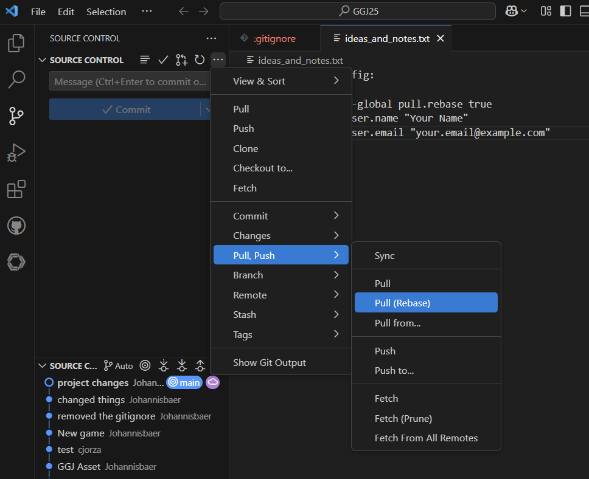
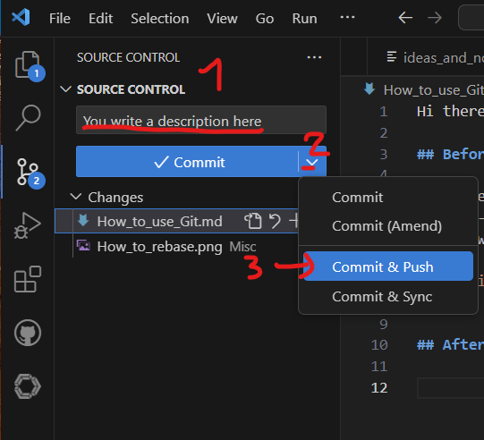

Hi there folks,

## Before you change files 

Before every new work, remember to pull a rebase - to get yourself updated with the latest work of everyone!

## After you changed files

You need to set:
- A comment (it's mandatory)
- Select the drop-down options
- Select Commit & Push

This will bring your changes to everyone!

